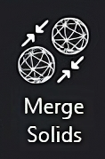
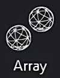
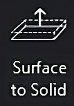
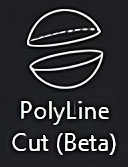

Edit Mode
==================
Edit mode contains various tools for editing a mesh.

.. image:: EditModeUpscaled.png
   :align: center

-----

.. image:: Hollow.png
   :align: right
   :width: 65

**1. Hollow**

Add a desired wall thickness to the selected mesh.

----

.. .. image:: Lattice.png
..    :align: right
..    :width: 65

.. **2. Lattice Infill**

.. Create an infill composed of square lattice by specifying the unit lattice size.

.. .. note:: 
..    To be used only after hollowing the mesh.

.. ----

.. image:: DrainHole.png
   :align: right
   :width: 70

**2. Drain Hole**

Create a hole (by specifying a diameter) in a hollowed mesh.

----

**3. Merge Solids** 

Merge all the selected meshes into one single mesh.

----

.. image:: shellToParts.png
   :align: right
   :width: 65

**4. Shell To Parts** 

Separate all the non-intersecting shells within a mesh into individual meshes.

----

.. image:: Scale.png
   :align: right
   :width: 65

**5. Scale** 

Scale the 3D mesh uniformly or directionally (along the X, Y or Z axis).

----

.. image:: Mirror.png
   :align: right
   :width: 65

**6. Mirror**

Mirror the 3D mesh along the X, Y and Z axis.

----

**7. Array** 

Generate copies of a mesh along x, y, and z axis by specifying the quantity and a gap between the copies.

----

**8. Surface to Solid** 

Generate a solid by offsetting a surface. 

----

.. image:: Cut.png
   :align: right
   :width: 60
   :class: "cut-img"

**9. Cut** 

To cut a mesh along a cutting plane oriented along the X, Y or Z axis.

----

**10. PolyLine Cut** 

To cut a mesh along a polyline.

----

.. image:: PolyLine_Split.png
   :align: right
   :width: 65

**11. PolyLine Split** 

To separate shells in an area marked by a polyline.
