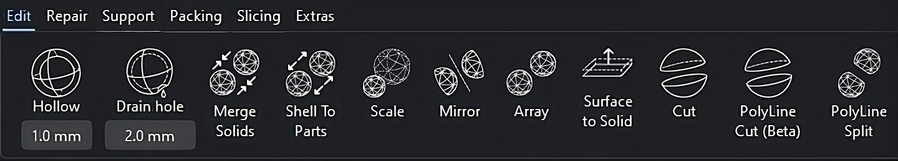
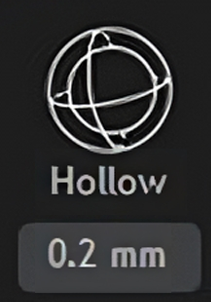
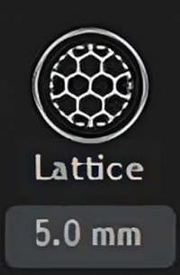
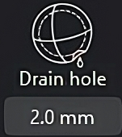
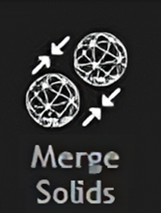
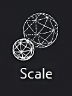
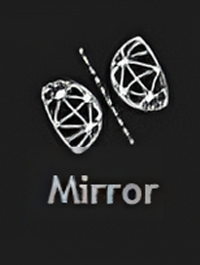
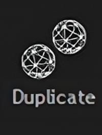
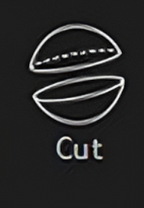

Edit Mode
==================
Edit mode contains various tools for editing a mesh.

-----

**1. Hollow**

Add a desired wall thickness to the selected mesh.

----

**2. Lattice Infill**

Create an infill composed of square lattice by specifying the unit lattice size.

.. note:: 
   To be used only after hollowing the mesh.

----

**3. Drain Hole**

Create a hole (by specifying a diameter) in a hollowed mesh.

----

**4. Merge Solids** 

Merge all the selected meshes into one single mesh.

----

.. image:: shellToParts.png
   :align: right
   :width: 60

**5. Shell To Parts** 

Separate all the non-intersecting shells within a mesh into individual meshes.

----

**6. Scale** 

Scale the 3D mesh uniformly or directionally (along the X, Y or Z axis).

----

**7. Mirror**

Mirror the 3D mesh along the X, Y and Z axis.

----

**8. Duplicate** 

Duplicate the 3D mesh.

----

**9. Cut** 

To cut a mesh along a cutting plane oriented along the X, Y or Z axis.
