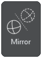

Edit and Repair Tabs
=====================

Edit Tab
---------------------------------

Edit mode contains various tools for editing a mesh.

----

**1. Pick Bottom**

Rotate the selected surface towards the ground.

----

**2. Scale** 

Scale the 3D mesh uniformly or directionally (along the X, Y or Z axis).

----

**3. Duplicate** 

Generate copies of a mesh along x, y, and z axis by specifying the quantity and a gap between the copies.

----

**4. Mirror**

Mirror the 3D mesh along the X, Y and Z axis.

----

**5. Hollow**

Create a hollow of the desired thickness and height.

----

.. .. image:: Lattice.png
..    :align: right
..    :width: 65

.. **2. Lattice Infill**

.. Create an infill composed of square lattice by specifying the unit lattice size.

.. .. note: 
..    To be used only after hollowing the mesh.

.. ----

**6. Drain Hole**

Create a hole (by specifying a diameter) in a hollowed mesh.

----

**7. Merge Solids** 

Merge all the selected meshes into one single mesh.

----

**8. Split** 

Split the selected parts.

----

**9. Lasso Split** 

Split the part wherever selection is made.

----

**10. Planar Cut** 

Cut the part along the X,Y or Z axis.

----

   

**11. Polyline Cut** 

To cut a mesh along a polyline.

----

   

**12. Lasso Triangle Removal** 

Remove unwanted parts/triangles.

----

   

**13. Dental Extrusion** 

Extrude and apply hollow on dental model with user parameters. 

----

   

**14. Remesh** 

Recreate surface of selected model with uniform triangles within user constraints.

----

   

**15. Triangle Reduction** 

Reduce the number of triangles in the selected mesh by specifying the percentage.

----

Repair Tab
---------------------------------

- The Repair mode aims at creating a 3D printable mesh/removing deformities present in a mesh (watertight, non-self intersecting and manifold mesh).
- In this mode,  users can inspect meshes and fix them, manually or automatically. Users can reduce triangles, smoothen the mesh, perform outer hull extraction, fill holes, etc. 

----

- When a mesh is loaded in MIRA3D software, it is inspected and represented as:

  .. image:: Part_List_Upscaled.png
     :align: center
     :width: 350

  - ❓   Mesh status not updated
  - ⛔  Mesh contains open shells and holes.
  - ⚠️  Mesh contains multiple watertight shells. 
  - ✅  Mesh contains single watertight shell.

----

Auto Repair
+++++++++++

|

**AutoFix** button repairs the 3D mesh using MIRA3D\'s PROPRIETARY REPAIR ALGORITHM.

User needs to select the file and press the AutoFix button. For example, if the slider is adjusted to 0.8 there will be 20% reduction in the number of triangles.

.. note:: 
  For coarse meshes, it is recommended to avoid triangle reduction by adjusting the slider to unit value.

----

| 

Manual Repair
++++++++++++++++

Users can enter the manual repair mode by double clicking on the file name (in the part list) or clicking on the **\“Shell repair\”** button. 

Here, users can view individual manifold shells of a mesh. Users can select (by using left click), isolate (by SHIFT + mouse drag) and delete individual shells of a mesh.

Watertight shells are marked in green✅ and open shells (containing holes) are marked in red⛔. Watertight and open shells can be sorted in the shell repair tab by double clicking on **\“Closed\”**.

After editing the shells, users need to click on **\“Update\”** to update the diagnostics.

.. image:: noholesAIUpscaled.png
   :align: center
   :width: 450

|

The tab above represents a repaired mesh, containing a single shell and no holes.

Previous or next 3D mesh can be brought to the tab by clicking on the **“Previous/Next''** button.

Manual Shell Repair
********************

**Steps**

#. In the shell repair tab, double click on the “Closed” (shell) header to view the list of all open and closed shells.
#. Click all closed shells(marked with✅) for any negative volumes. In case of such shells select them and click on the “Fix Inversion” button.
#. Check all open shells (marked with ⛔).

   Cases:

   #. If the holes seem too small to be visually identified or planar, fix them by selecting them and clicking on the **“Fill holes”**  button. Additionally, check for small sized floating shells and eliminate them by clicking on the **“Remove all noise”** button.
   #. If the holes are large and non-planar then look for other open shells which can cover the hole. Unify those shells by selecting them, using the **“Unify selected”** button. Later on remove any extra noise that may be generated and fill the holes using the **“Fill holes”** button.

#. Once all the shells are green, click on the **“Autofix”** button.

.. note:: 
   The user may also click on **“Unify selected”** instead of **“Autofix”**. However, this is comparatively slower, and shall involve an additional step of removing the noise shells and filling holes at the end.

