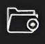

File Operations Tab
===================

.. |shift| image:: ../kbd-icon/shift-button-icon.svg
   :height: 40px
   :width: 40px
   :class: kbd-icon

.. |r| image:: ../kbd-icon/r-button-icon.svg
   :height: 25px
   :width: 25px
   :class: kbd-icon

.. |del| image:: ../kbd-icon/del-delete-button-icon.svg
   :height: 30px
   :width: 30px
   :class: kbd-icon

----

**1. Load** 

To load single or multiple files. Keyboard shortcut: |ctrl| + |i|.

----

**2. Load Folder** 

To load all the files contained in a folder. Keyboard shortcut: |ctrl| + |shift| + |i|.

----

.. image:: Reload.png
   :align: right
   :width: 45

**3. Reload File**: 

To replace the current (edited) file by its original version. Keyboard shortcut: |ctrl| + |r|.

----

**4. Delete File**

To delete the selected file(s). Keyboard shortcut: |del| key.

----

.. image:: Save.png
   :align: right
   :width: 45

**5. Save** 

To save the selected files in MIRA format (proprietary file format by MIRA3D that can achieve file up to 20X compression without any triangle reduction or visible loss in detail). 
  
Keyboard shortcut: |ctrl| + |s|.

----

**6. Export** 

To export the file in formats such as STL, OFF, 3MF, PLY, JSON. 
  
Keyboard shortcut: |ctrl| + |e|.

----

.. image:: QuickArrange.png
   :align: right
   :width: 45

**7. Quick arrange**: 

To arrange all the loaded files as per their bounding boxes on the print bed Keyboard shortcut: |ctrl| + |shift| + |a|.