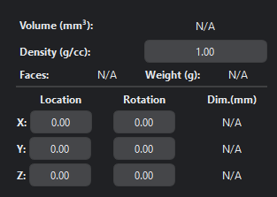

Mesh Properties Tab
=======================

=====

For the selected file, this tab displays the **mesh properties** such as:

**1. Faces**-Number of triangles in selected part(s)

**2. Volume**-Estimated print volume of selected part(s)

.. note:: 
  Click on the **CALCULATE** button to get the volume of the file(s).

**4. Bounding box dimensions**

**5. Location on the print bed**
  
Users can translate the object along the X, Y and Z-axis by typing the coordinates or using scroll wheel (while keeping the cursor on the respective boxes).

**6. Rotation (Orientation)**

Users can rotate the object along the X, Y and Z-axis by typing the desired numerical values or using scroll wheel (while keeping the cursor on the respective boxes).

**7. Weight**

Users can estimate  the weight of a 3D mesh by entering the density of the material in which the object is to be manufactured.