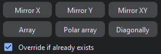

Support Tab
=================

In this mode, users can add different support profiles like beam, scaffold and tree supports.

.. image:: supportModeBar.png
   :align: center

----

1. **Interior Zone Gap**: Minimum gap between supports applied in the internal areas of the overhang surface(in red).

2. **No Support Offset**: Minimum legth of prongs where supports shall be applied.

3. **Boundary Zone Gap**: Minimum gap between supports applied in the overhang feature edges (boundary areas) of the part.

4. **Boundary Offset**: Minimum gap between support and the overhang feature edges of the part.

5. **Gap Between Stems**: Minimum gap between tree stems.

6. **Stem Radius**: Stem radius of the tree.

7. **Branch Radius**: Branch radius of the tree.

8. **Max Branch Length**: Maximum allowed length of (tree) branches.

9. **Part Lift**: Height upto which the part shall be lifted.

10. **Scaffold Radius**: Radius of scaffold applied between each stem.

11. **Max Scaffold Length**: Maximum allowed length of a scaffold bar.

12. **Scaffold Start Height**: The height above which scaffolds are applied.

13. **Overhang Angle**: Critical angle of triangles(with respect to the vertical axis) where supports shall be applied.

14. **Feature Edge Angle**: Maximum angle of adjacent faces by which feature edges shall be recognized.

15. **Raft Width**: Width of the bars in base plate.

16. **Raft Height**: Height of the bars in base plate.

17. **Minimum Bezel Height**: Minimum length of part to part support.

18. **Maximum Bezel Height**: Maximum length of part to part support.

19. **Bezel Radius Ratio**: Ratio of part to part support radius with branch radius.

20. **Part Support Gap**: Minimum gap between tree branches/ground supports and part.

.. .. image:: autogenerate.png
..    :scale: 50 %
..    :align: right
   
.. Auto Generate
.. ++++++++++++++

.. This feature adds beam and scaffolded support to a 3D mesh.

|

----

.. image:: autogenerateMenu.png
   :scale: 52 %
   :align: right

MIRA3D offers three sample profiles: Light, Medium and Heavy. In addition, the top, mid and bottom part of the beam support can be customized.

|
|

.. .. image:: multi.png
..    :scale: 60 %
..    :align: right

.. Users need to enter the desired gap between the supports using “Gap betn support” option and specify the “Overhang angle” (highlighted in red).

.. .. note::
..   Automatically generated  supports are added only to the overhang area.

.. If more supports need to be added for a chosen overhang region, users must decrease the gap in the **“Gap betn support”** settings.

.. Manual Support
.. ++++++++++++++

.. Once the user is in support mode, manual support can be added to the part, by left clicking on the overhang area (marked in red).

.. If the user needs scaffolding, **“Auto Scaffold”** checkbox needs to be ticked, with sufficient settings of the **“Gap betn support”**.

.. .. note:: 
..   Manual and automatic supports can only be added to the overhang area.

.. ----

.. .. image:: prop.png
..    :width: 10 %
..    :align: right

.. **Prop**

.. Prop is a beam support that connects two regions of a geometry for enhancing part strength. It can be generated simply by left clicking two points on the 3D mesh, which ought to be connected.

.. ----

.. .. image:: autotree.png
..    :width: 10 %
..    :align: right

.. **Auto Tree**

.. Similar to **“Auto generate”** feature, **“Auto tree”** adds branching to regions having higher support density and beam support elsewhere. The number of branches equals the number input  in the **“Auto Tree”** box.

.. ----

.. .. image:: treeselected.png
..    :width: 10 %
..    :align: right

.. **Tree Selected**

.. Transforms selected beam supports into a tree support.

.. |

.. ----

.. .. image:: scaffold_selected.png
..     :width: 10 %
..     :align: right

.. **Scaffold Selected**

.. Add scaffolding to the selected supports.

-------

*Support Operations*
-----------------------

|

.. cssclass:: custom-heading

1\. Mirror X
  
   Mirror the selected supports along X-axis.

.. cssclass:: custom-heading
   
2\. Mirror Y
  
   Mirror the selected supports along Y-axis.

.. cssclass:: custom-heading

3\. Mirror XY
  
   Mirror the selected supports along X & Y axes.

.. cssclass:: custom-heading

4\. Polar Array
  
   Generate copies of the selected supports around the vertical axis by specifying the quantity and the angle coverage.

.. cssclass:: custom-heading

5\. Mirror Diagonally
  
   Mirror the selected supports along the diagonal of the XY plane.

.. cssclass:: custom-heading

6\. Array
  
   Generate copies of the selected support(s) by specifying the quantity and a gap between the copies.

.. note:: 
   If the checkbox is selected, the supports will be re-added.

--------

**Merge Supports**

To merge the support mesh with the part mesh.

