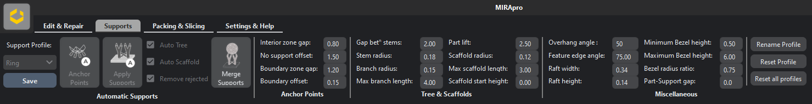

Support Mode
=================

In this mode, users can add different support profiles like beam, scaffold and tree supports.

----

   
Auto Generate
++++++++++++++

This feature adds beam and scaffolded support to a 3D mesh.

|

----

Before clicking on the **“Auto Generate”** button, it is recommended to select the appropriate support profiles.

MIRA3D offers three sample profiles: Light, Medium and Heavy. In addition, the top, mid and bottom part of the beam support can be customized.

|
|

====

.. image:: multi.png
   :scale: 60 %
   :align: right

Users need to enter the desired gap between the supports using “Gap betn support” option and specify the “Overhang angle” (highlighted in red).

.. note::
  Automatically generated  supports are added only to the overhang area.

If more supports need to be added for a chosen overhang region, users must decrease the gap in the **“Gap betn support”** settings.

Manual Support
++++++++++++++

Once the user is in support mode, manual support can be added to the part, by left clicking on the overhang area (marked in red).

If the user needs scaffolding, **“Auto Scaffold”** checkbox needs to be ticked, with sufficient settings of the **“Gap betn support”**.

.. note:: 
  Manual and automatic supports can only be added to the overhang area.

----

**Prop**

Prop is a beam support that connects two regions of a geometry for enhancing part strength. It can be generated simply by left clicking two points on the 3D mesh, which ought to be connected.

----

**Auto Tree**

Similar to **“Auto generate”** feature, **“Auto tree”** adds branching to regions having higher support density and beam support elsewhere. The number of branches equals the number input  in the **“Auto Tree”** box.

----

**Tree Selected**

Transforms selected beam supports into a tree support.

|

----

**Merge to Geometry**

To merge the support mesh with the part mesh.

