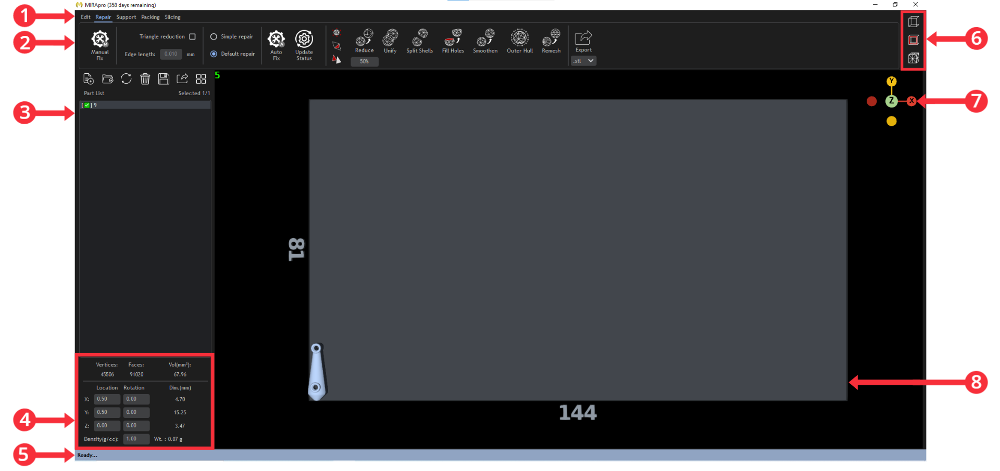

User Interface
==============

1. **Menu Modes**: Groups MIRA operations by edit/repair/support/packing/slicing mode.
2. **Tool Tab**: Contains all the file operations of the selected mode.
3. **File Operation Tab**: To load file, load folder, reload file, delete file, save file(s), export file and quickly arrange files.
4. **Mesh Properties Tab**: Displays mesh properties of the selected file and allows users to translate or rotate the mesh.
5. **Operation Status Bar**: Displays the status of the file operation being performed.
6. **View Tools**: Contains buttons to toggle between view(orthographic/perspective) mode, section view mode and wireframe mode.
7. **Viewport**: To toggle between views along the X/Y/Z axis.
8. **Print Bed**: Represents the machine platform, where meshes are placed and file operations are performed.