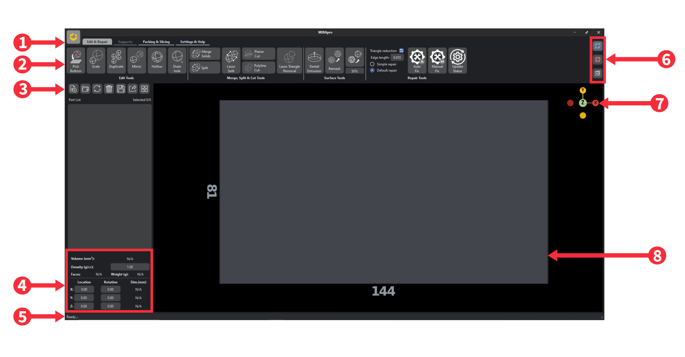

User Interface
==============

1. **Feature Modules**: Groups MIRA operations by edit and repair/support/packing and slicing tabs.
2. **Tools**: Contains all the file operations of the selected tab.
3. **File Operation Tools**: To load file, load folder, reload file, delete file, save file(s), export file and quickly arrange files.
4. **Mesh Properties Section**: Displays mesh properties of the selected file and allows users to translate or rotate the mesh.
5. **Operation Status Bar**: Displays the status of the file operation being performed.
6. **Render Tools**: Contains buttons to toggle between view(orthographic/perspective) mode, section view mode and wireframe mode.
7. **Quickview**: Quickly switch the camera angle along the X/Y/Z axis.
8. **Print Bed**: Represents the machine platform, where parts are placed and file operations are performed.