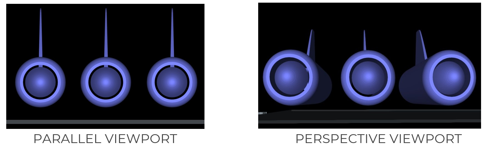

General Tools
=============

**1. View Projection**

To toggle between **parallel/orthographic** and **perspective** viewport projection.

----

**2. Clipping Plane**

To clip the object along the X, Y or Z axis.

----

**3. Display Modes**

To toggle between shaded mode and wireframe mode.

