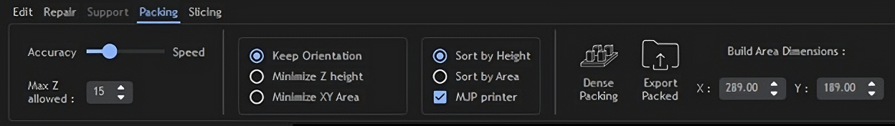
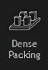
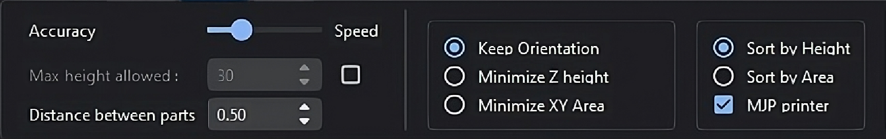
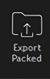
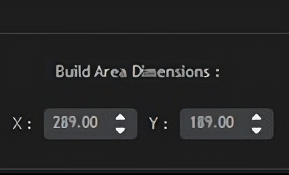

Packing Mode
============

Packing mode is used to nest 3D meshes in an efficient way. 
Users can nest 3D meshes while keeping orientation fixed or minimizing height/area.

----

**1. Dense Packing**

**“Dense Packing”** button is to be pressed only after considering selecting appropriate parameters in the following:

  
**1. Accuracy/Speed Slider**
  “Accuracy” will give higher packing density and Speed” will give higher packing speed.

**2. Max Z Allowed**
  To limit the orientation of 3D meshes up to a certain height.

**3. Packing based on orientation of 3D meshes**
  KEEP ORIENTATION: 3D meshes are rotated around the Z-axis during packing.(advisable in case of  auto placement of jewellery files for DLP/LCD printing)

  MINIMIZE Z HEIGHT: 3D meshes are oriented to achieve minimum part height (normally used in printing technologies like MJP/ FDM to reduce printing time).

  MINIMIZE XY AREA: 3D meshes are oriented to achieve minimum part area.

**4. Packing based on placement of 3D meshes**
  SORT BY HEIGHT: To place 3D meshes with maximum height first.

  SORT BY AREA    : To place 3D meshes with maximum area first.

----

**MJP Printer**: Select the checkbox to disable the aspect ratio and enable MJP feature (Lane by lane packing). 

----

**2. Export Packing**

To export all the packed files as a single STL file. Files are saved at location: **“PC/Documents/Mira3D/Packed_files”**

----

**3. Build Area Dimensions**

Allows the user to change build platform size. Default aspect ratio set to 16:9 (standard DLP 3D printer).

