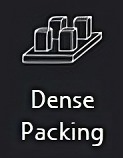

Packing Mode
============

Packing mode is used to nest 3D meshes in an efficient way. 
Users can nest 3D meshes while keeping orientation fixed or minimizing height/area.

    
----

.. cssclass directives are used to provide the element below the specified class, thereby allowing custom css!

.. cssclass:: custom-heading
  
**1. Dense Packing**

**“Dense Packing”** button is to be pressed only after considering selecting appropriate parameters in the following:

----

.. image:: all4options.png
   :align: center
   :class: "all-4-options"
  
**i. Accuracy/Speed Slider**
  “Accuracy” will give higher packing density and Speed” will give higher packing speed.

**ii. Max Z Allowed**
  To limit the orientation of 3D meshes up to a certain height.

**iii. Packing based on orientation of 3D meshes**
  .. cssclass:: underlined

  **Keep Orientation**: 3D meshes are rotated around the Z-axis during packing.(advisable in case of  auto placement of jewellery files for DLP/LCD printing)

  .. cssclass:: underlined

  **Minimize Z Height**: 3D meshes are oriented to achieve minimum part height (normally used in printing technologies like MJP/ FDM to reduce printing time).

  .. cssclass:: underlined

  **Minimize XY Area**: 3D meshes are oriented to achieve minimum part area.

**iv. Packing based on placement of 3D meshes**

  .. cssclass:: underlined

  **Sort by Height**: To place 3D meshes with maximum height first.

  .. cssclass:: underlined

  **Sort by Area**: To place 3D meshes with maximum area first. 

----

.. cssclass:: underlined

**MJP Printer**: Select the checkbox to disable the aspect ratio and enable MJP feature (Lane by lane packing). 

----

.. cssclass:: custom-heading

**2. Fast Packing**
  
  --- Description of Fast Packing here ---

**i. Distance between parts:**
  To set the desired gap between parts for “Fast Packing”.

----

.. cssclass:: custom-heading

**3. Export Packing**

To export all the packed files as a single STL file. Files are saved at location: **“PC/Documents/Mira3D/Packed_files”**

----

.. image:: BuildAreaDims.png
   :align: right
   :scale: 70 %

.. cssclass:: custom-heading
  
**4. Build Area Dimensions**

Allows the user to change build platform size. Default aspect ratio set to 16:9 (standard DLP 3D printer).

