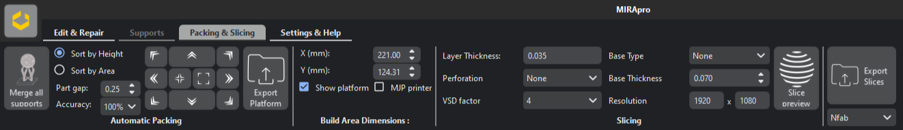
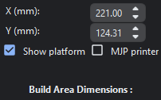

Packing and Slicing Tabs
============

Packing Tab
---------------------------------

Packing mode is used to nest 3D meshes in an efficient way. 
Users can nest 3D meshes while keeping orientation fixed and minimizing area.

    

.. cssclass directives are used to provide the element below the specified class, thereby allowing custom css!

.. .. image:: DensePacking.png
..    :align: right
..    :scale: 60
..    :class: "dense-packing"

.. .. cssclass:: custom-heading
  
.. **1. Dense Packing**

.. **“Dense Packing”** button is to be pressed only after considering selecting appropriate parameters in the following:

.. .. image:: all4options.png
..    :align: center
..    :class: "all-4-options"
  
.. **i. Accuracy/Speed Slider**
..   “Accuracy” will give higher packing density and Speed” will give higher packing speed.

.. **ii. Max Z Allowed**
..   To limit the orientation of 3D meshes up to a certain height.

.. **iii. Packing based on orientation of 3D meshes**
..   .. cssclass:: underlined

..   **Keep Orientation**: 3D meshes are rotated around the Z-axis during packing.(advisable in case of  auto placement of jewellery files for DLP/LCD printing)

..   .. cssclass:: underlined

..   **Minimize Z Height**: 3D meshes are oriented to achieve minimum part height (normally used in printing technologies like MJP/ FDM to reduce printing time).

  .. .. cssclass:: underlined

  .. **Minimize XY Area**: 3D meshes are oriented to achieve minimum part area.

.. .. image:: fast_packing.png
..    :align: right
..    :scale: 60 % 

.. .. cssclass:: custom-heading

.. **2. Fast Packing**
  
..   --- Description of Fast Packing here ---

.. **i. Distance between parts:**
..   To set the desired gap between parts for “Fast Packing”.

.. ----

.. .. image:: exportPacked.png
..    :align: right
..    :scale: 80 %

.. cssclass:: custom-heading

**1. Packing Options**

**Packing based on placement of 3D meshes**

  .. cssclass:: underlined

  **a. Sort by Height**: To place 3D meshes with maximum height first.

  .. cssclass:: underlined

  **b. Sort by Area**: To place 3D meshes with maximum area first. 

  1. **Top-Left**: Arranges the parts on the top left corner of the print bed.

  2. **Top**: Arranges the parts on the top of the print bed.

  3. **Top-Right**: Arranges the parts on the top right corner of the print bed.

  4. **Right**: Arranges the parts on the right of the print bed.

  5. **Bottom-Right**: Arranges the parts on the bottom right corner of the print bed.

  6. **Bottom**: Arranges the parts on the bottom of the print bed.

  7. **Bottom-Left**: Arranges the parts on the bottom left corner of the print bed.

  8. **Left**: Arranges the parts on the left side of the print bed.

  9. **Center**: Arranges the parts in the center of the print bed.

  10. **Border**: Arranges the parts on the border of the print bed.

  

----

.. .. cssclass:: underlined

.. **MJP Printer**: Select the checkbox to disable the aspect ratio and enable MJP feature (Lane by lane packing). 

.. ----

.. cssclass:: custom-heading

**2. Export Platform**

To export all parts inside base plate into single stl file.

----

.. cssclass:: custom-heading
  
**3. Build Area Dimensions**

Allows the user to change build platform size. Default aspect ratio set to 16:9 (standard DLP 3D printer).

.. cssclass:: underlined

**MJP Printer**: Select the checkbox to disable the aspect ratio and enable MJP feature (Lane by lane packing). 

----

Slicing Tab
---------------------------------

Slice mode slices packed mesh files with customisable options such as resolution, base type, base thickness, layer thickness, anti-aliasing factor and blur radius.

Currently, the MIRA3D can generate slices only in PNG file format.

**1. Layer Thickness**

To specify the layer thickness in which the build-platform is to be sliced.

**2. Perforation**

To add perforation to the base.

**3. VSD Factor**

Propreitary MIRA algorithm for improved part surface smoothness.

**4. Base Type**

To select the appropriate base type (outer boundary/bounding box).

**5. Base Thickness**

To add thickness to the base.

**6. Resolution**

To set the resolution of the slices according to the printer resolution.

*Finally, use the Slice option to slice all the packed mesh files.*

