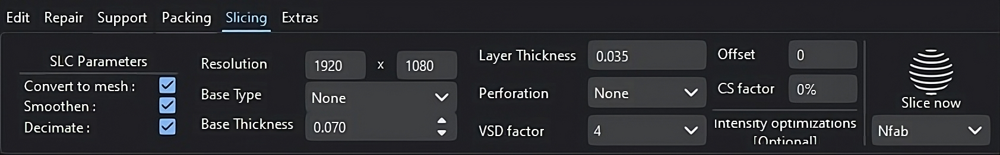

Slice Mode
==========

|

Slice mode slices packed mesh files with customisable options such as resolution, base type, base thickness, layer thickness, anti-aliasing factor and blur radius.

Currently, the MIRA3D can generate slices only in PNG file format.

----

**1. SLC Parameters**

a. **Convert** to Mesh: To generate 3D triangular mesh.
b. **Smoothen**: To smoothen the mesh.
c. **Decimate**: To reduce the number of triangles in the mesh.

**2. Resolution**

To set the resolution of the slices according to the printer resolution.

**3. Base Type**

To select the appropriate base type (outer boundary/bounding box).

**4. Base Thickness**

To add thickness to the base.

**5. Layer Thickness**

To specify the layer thickness in which the build-platform is to be sliced.

**6. Perforation**

To add perforation to the base.

**7. VSD Factor**

Propreitary MIRA algorithm for improved part surface smoothness.

*Finally, use the Slice option to slice all the packed mesh files.*